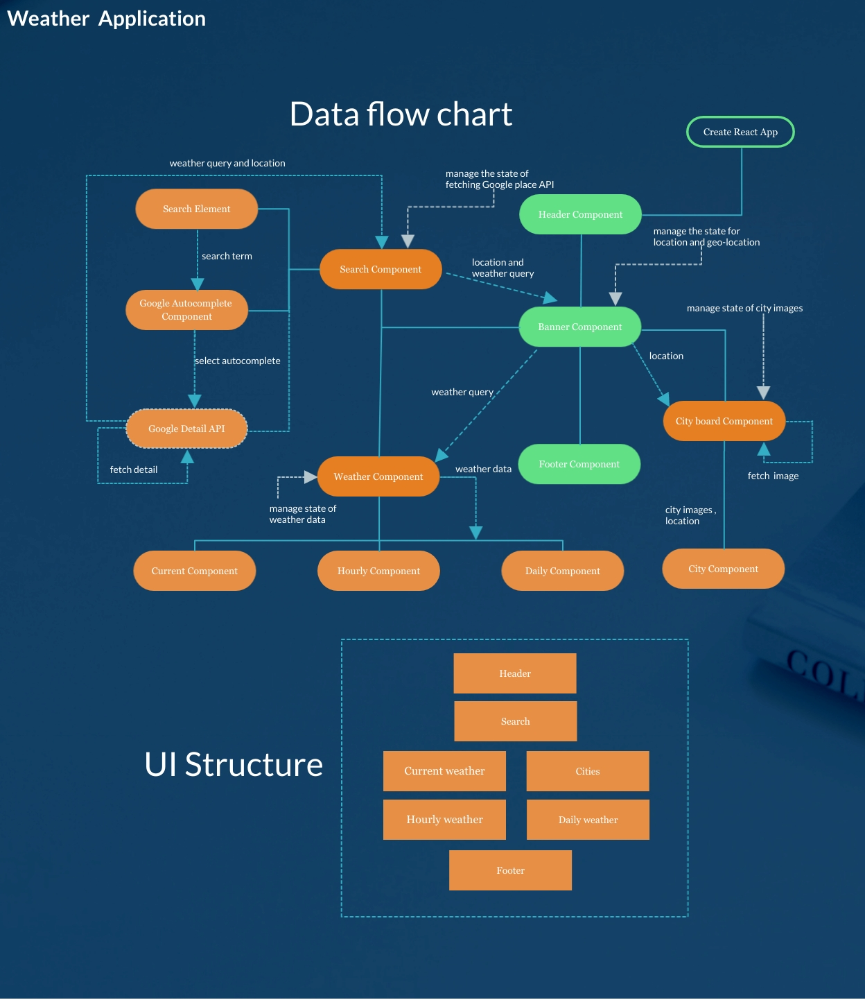

This project was bootstrapped with [Create React App](https://github.com/facebook/create-react-app).

### Running on local

#### Clone repo to local environment

`git clone https://github.com/wordpree/local-weather.git`.

#### Install relative dependency

`npm install`

### `npm start`

Runs the app in the development mode. 
Open [http://localhost:3000](http://localhost:3000) to view it in the browser.

### Weather forcast

Real time | Hourly | Daily  
Switch back and forth for the previous locations of weather details based on your interested cities.

### Data comsuming resources

Powed by [Google place API](https://developers.google.com/places/web-service/overview) | [Open weather map](https://openweathermap.org/) | [Unsplash](https://www.unsplash.com/).

### CORS

**Note:In order to avoid Cross-Origin request issue, it implements [cors-anywhere](https://cors-anywhere.herokuapp.com/). Make sure the proxy run smoothly**

### Technologies Used

- :bowtie: Rest API

- :koala: Material UI

- :dog: Custom Hooks

- :fish: Framer Motion

- :sunflower: React Hooks

- :bear: Typescript

### Live Demo

[Weather forcast app](https://inspiring-weather.netlify.app/)
